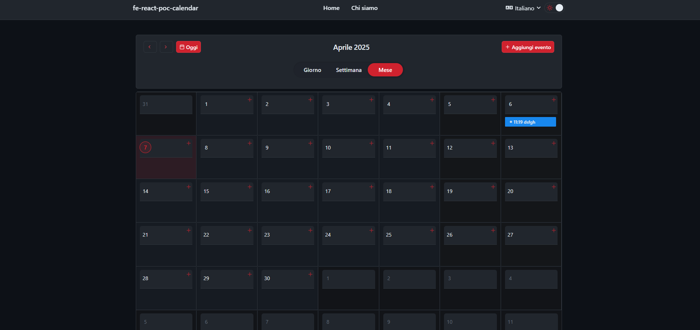

# fe-react-poc-calendar

<p align="center">
  
</p>

[](https://reactjs.org/)
[](https://www.typescriptlang.org/)
[](https://vitejs.dev/)
[](https://styled-components.com/)
[](https://redux-toolkit.js.org/)
[](LICENSE)

A modern and feature-rich React calendar application with multiple views (day, week, month) and advanced event management capabilities.

<p align="center">
   <div style="display: flex; justify-content: center; align-items: center; gap: 10px;">
      
   </div>
</p>

## Features

- 📅 **Multiple Calendar Views**: Day, Week, and Month views for flexible planning
- 📱 **Modern UI**: Sleek and intuitive interface inspired by Ant Design with 2025 UX standards
- 🎨 **Theme Support**: Light mode with soft cream tones and dark mode with very dark colors
- 🎯 **Color Palette Selection**: Customizable accent colors to personalize your experience
- 🔄 **State Management**: Redux Toolkit for predictable state management
- 💾 **Persistent Storage**: Your data remains intact even after page refresh
- 📥 **Import/Export Data**: Easily backup and restore your calendar events
- 🛣️ **Routing**: React Router v6 for seamless navigation between views
- 🧰 **Styled Components**: Modern and responsive UI components
- 🧪 **Mock Mode**: Development without backend dependencies
- 🌐 **Internationalization**: Multi-language support (English, Italian)

## Getting Started

### Prerequisites

- Node.js 20.x or higher
- npm or yarn
- Docker (optional, for containerized deployment)

### Installation

1. Clone the repository:

```bash
git clone https://github.com/5h1ngy/fe-react-poc-calendar.git
cd fe-react-poc-calendar
```

2. Install dependencies:

```bash
npm install
# or
yarn
```

3. Start the development server:

```bash
# Standard development mode
npm run start:dev
# or with mock API enabled
npm run start:mock
```

4. Open your browser and navigate to `http://localhost:5173`

## Project Structure

```
fe-react-poc-calendar/
├── public/               # Static assets
├── src/
│   ├── components/       # Reusable components
│   │   ├── calendar/     # Calendar-specific components
│   │   │   ├── DayView/  # Day view components
│   │   │   ├── WeekView/ # Week view components
│   │   │   ├── MonthView/# Month view components
│   │   │   └── ...       # Other calendar components
│   │   └── ui/           # Base UI components
│   ├── layouts/          # Layout components
│   ├── locales/          # Translation files
│   │   ├── en/           # English translations
│   │   └── it/           # Italian translations
│   ├── pages/            # Page components
│   │   ├── CalendarPage/ # Main calendar page
│   │   ├── SettingsPage/ # Settings page
│   │   └── ...           # Other pages
│   ├── providers/        # Context providers
│   ├── services/         # API services
│   │   ├── api/          # Real API services
│   │   ├── i18n/         # Internationalization setup
│   │   └── mock/         # Mock implementations
│   ├── store/            # Redux store setup
│   │   └── slices/       # Redux slices (events, calendar, theme, etc.)
│   ├── types/            # TypeScript type definitions
│   ├── utils/            # Utility functions
│   │   ├── calendar/     # Calendar-specific utilities
│   │   ├── datetime/     # Date/time handling utilities
│   │   ├── export/       # Import/export utilities
│   │   └── ...           # Other utilities
│   ├── App.tsx           # Main App component
│   └── main.tsx          # Entry point
├── .env.development      # Development environment variables
├── .env.mock             # Mock environment variables
├── .env.prod             # Production environment variables
├── package.json          # Dependencies and scripts
├── tsconfig.json         # TypeScript configuration
└── vite.config.ts        # Vite configuration
```

## Configuration

### Environment Variables

The boilerplate includes three environment files:

- `.env.development` - Used during local development
- `.env.mock` - Used when running in mock mode
- `.env.prod` - Used for production builds

You can modify these files to set API URLs, feature flags, and other environment-specific settings.

### Mock Mode

Mock mode allows you to develop without a backend by simulating API responses. 

To enable mock mode:

1. Ensure the `VITE_APP_MOCK_ENABLED` flag is set to `true` in `.env.mock`
2. Start the application in mock mode: `npm run start:mock`

Mock implementations are located in `src/services/mock/` and can be customized as needed.

## Theming

The boilerplate includes a comprehensive theming system with:

### Light and Dark Modes

The application automatically respects the user's system preference for light or dark mode, with an option to override.

Theme mode can be toggled using the `ThemeSwitcher` component or via Redux actions:

```javascript
import { toggleThemeMode } from '@/store/slices/themeSlice';
import { useDispatch } from 'react-redux';

const dispatch = useDispatch();
dispatch(toggleThemeMode());
```

### Accent Colors

Users can customize the accent color of the application. Available colors are defined in the theme configuration.

To change the accent color:

```javascript
import { setAccentColor } from '@/store/slices/themeSlice';
import { useDispatch } from 'react-redux';

const dispatch = useDispatch();
dispatch(setAccentColor('blue')); // 'blue', 'purple', 'teal', etc.
```

## Available Scripts

- `npm run start:dev` - Start development server
- `npm run start:mock` - Start development server with mock API enabled
- `npm run build:prod` - Build for production
- `npm run preview:prod` - Preview production build locally
- `npm run lint` - Run ESLint
- `npm run clean` - Remove dist and node_modules directories
- `npm run docker:build` - Build Docker image
- `npm run docker:run` - Run Docker container (after building)
- `npm run docker:build-run` - Build and run Docker container in one command
- `npm run docker:push` - Tag and push Docker image to registry

## Internationalization (i18n)

The application supports multiple languages out of the box using i18next and react-i18next.

### Supported Languages

- English (default)
- Italian

### Directory Structure

Translation files are organized by language in the `src/locales` directory:

```
src/locales/
├── en/
│   └── translation.json   # English translations
└── it/
    └── translation.json   # Italian translations
```

### Adding New Translations

1. Create a new translation file in the appropriate language folder
2. Update the i18n configuration in `src/services/i18n/index.ts` to include the new language
3. Add the language option to the `LanguageSwitcher` component in `src/components/LanguageSwitcher/LanguageSwitcher.tsx`

### Using Translations in Code

To use translations in your components:

```jsx
import { useTranslation } from 'react-i18next';

function MyComponent() {
  const { t } = useTranslation();
  
  return (
    <div>
      <h1>{t('common.title')}</h1>
      <p>{t('common.description')}</p>
    </div>
  );
}
```

### Language Detection

The application automatically detects the user's preferred language based on browser settings and remembers language choices using localStorage.

Users can manually switch languages using the language selector in the application header.

## Data Persistence and Import/Export

### Data Persistence

The application uses Redux Persist to save your calendar events and settings locally, ensuring your data remains intact even after closing or refreshing the browser.

### Importing and Exporting Data

You can easily backup and share your calendar data with the built-in import/export feature:

1. **Export Data**: Navigate to Settings → Export Data to download a JSON file with all your calendar events
2. **Import Data**: Go to Settings → Import Data to upload a previously exported JSON file

## Docker Deployment

This project includes a ready-to-use Docker setup for production deployment with Nginx as a web server.

### Building and Running with Docker

1. Build the Docker image:

```bash
npm run docker:build
# or directly with Docker
docker build -t fe-react-poc-calendar:latest .
```

2. Run the container:

```bash
npm run docker:run
# or directly with Docker
docker run -p 8080:80 fe-react-poc-calendar:latest
```

3. Access the application at `http://localhost:8080`

### Using Docker Compose

You can also use Docker Compose for a more declarative approach:

```bash
docker-compose up -d
```

This will build the image if it doesn't exist and start the container in detached mode.

### Docker Image Details

The Docker setup uses a multi-stage build process:

1. **Build Stage**: Uses Node.js to build the React application
2. **Production Stage**: Uses Nginx to serve the built static files

Benefits of this approach:
- **Smaller image size**: Final image only contains what's needed to run the application
- **Better performance**: Nginx is optimized for serving static content
- **Enhanced security**: No build tools or source code in the production image

The Nginx configuration includes:
- Gzip compression for better performance
- Cache control headers for static assets
- Proper handling of SPA routing
- Security headers for better protection

## Contributors

- **[5h1ngy](https://github.com/5h1ngy)** - Main author and project maintainer
- **[Davide1786](https://github.com/Davide1786)** - Contributor and fork maintainer

## Contributing

1. Fork the repository
2. Create your feature branch: `git checkout -b feature/my-new-feature`
3. Commit your changes: `git commit -am 'Add some feature'`
4. Push to the branch: `git push origin feature/my-new-feature`
5. Submit a pull request

## License

This project is licensed under the MIT License - see the LICENSE file for details.
